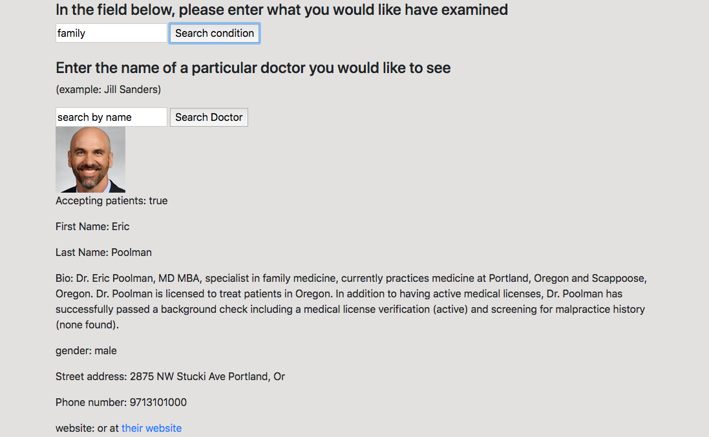
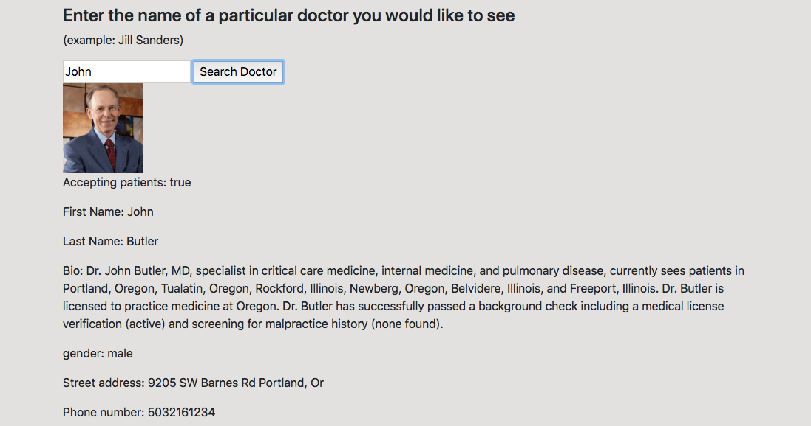

# Doctor Lookup

#### By **Robbie Kruszynski**

## Description

An application that allows a user to input their medical issue and view a list of doctors in the area (Portland, OR). It will beyond a list of doctors, show detailed information such as their first and last name, address, phone number, website, and whether or not the doctor is accepting new patients.  

## Specs

* Be sure to reload the page after a search

| Behavior | Input | Output |
|----------|-------|--------|
* Behavior
* User inputs "family"
* 
* User inputs "family"
* 

### Setup/Installation Requirements
* As of 03/22/19:
* Open your preferred browser
* copy / paste the following link
https://github.com/Robbiekruszynski/doctor-search
* Make sure you're in your Desktop directory
* clone or download the following .git        https://github.com/Robbiekruszynski/doctor-search.git
* Open your terminal and navigate to doctor-search directory
(cd desktop --cd doctor-search)
* Once in your terminal and proper directory run the command
* `npm install` to install dependencies
* `npm run start` to build and start the dev server

## Technologies Used
* HTML
* CSS
  * SASS
* JavaScript
* Node.js
* jQuery 3.3.1
* Bootstrap 4.1.3
* Babel
* Custom Webpack

## Known Bugs

* There are no known bugs as of March 22nd 2019

## Support and contact details

_Email robbiekruszynski@gmail.com with any questions._

## License

This software is licensed under the MIT license.

Copyright (c) 2018 **Robbie Kruszynski**
